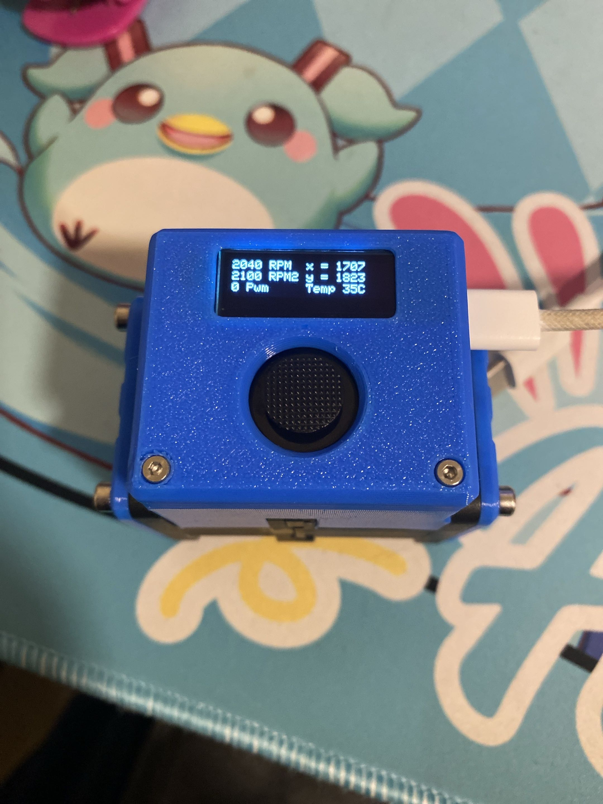

Measuring only 40x63x68 its a tiny little pain in the ass to solder and put together, mostly because of the 20 tiny fiddly wires that go everywhere but its really cute and loud so thats all that matters

The code is a mess but functions and the cad is final 

- Electronics required 
  - Esp32 s3 super mini
  - Mini360 or similar buck converter
  - 128x32 0.92" i2c oled
  - PSP 1000 joystick (the one with pads on the bottom)
  - USBc Trigger board eiter adjustable or set to 12v
  - Delta [GFC0412D](https://www.delta-fan.com/Download/Spec/GFC0412DS-SM06B0G.pdf) 
  - A diode may be needed if your buck converter lacks one to prevent voltage backflow when programing the esp32
- Hardware required
  - M2x3x3.2 heatset insert X4
  - M2x8 cap head bolt X2
  - M2x3 button head bolt X2
  - M3x25 cap head bolt X4
  - Hot glue gun
- Future plans
  - Website for remote control over wifi
  - Better oled ui with proper menus and a nicer look
  - Mk ii using an even louder and faster spinning fan in the same footprint 

 
 
 
